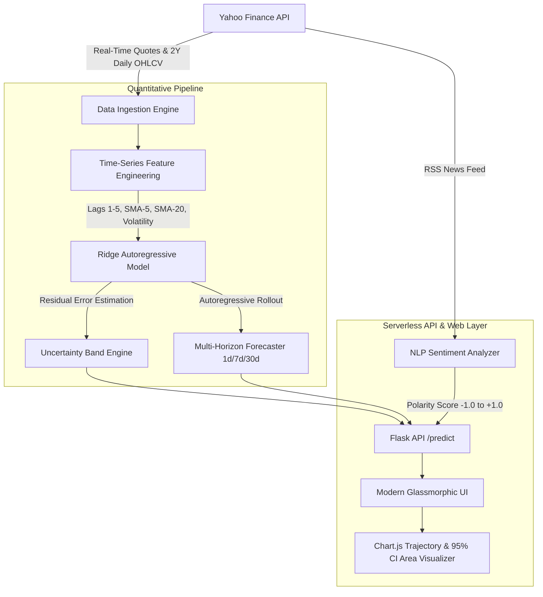

# 📈 TrendIQ — Quantitative Time-Series Stock Forecasting & Sentiment Intelligence

[](https://www.python.org/downloads/)
[](https://flask.palletsprojects.com/)
[](https://opensource.org/licenses/MIT)
[](https://vercel.com/)

**TrendIQ** is an end-to-end quantitative financial engineering platform that generates multi-horizon price projections, analytical uncertainty confidence intervals, and real-time news sentiment indicators for US equities.

Engineered specifically to solve the data leakage and lookahead biases common in naive stock predictor clones, TrendIQ benchmarks all models strictly against the **Naive Persistence (Random Walk) Baseline** across out-of-sample test windows.

---

## 🏛️ System Architecture



---

## 🔬 Quantitative Methodology & Empirical Benchmarks

### 1. The Core Flaw in Typical Stock Machine Learning
Standard machine learning projects routinely shuffle time-series data or use random k-fold cross-validation. In financial markets, this introduces severe **lookahead bias (data leakage)** because past prices are predicted using future information, leading to artificial, unreplicable accuracy claims.

TrendIQ strictly enforces a **chronological 80/20 train/test split**:
* **Training Set:** Oldest 80% of historical trading days.
* **Test Set:** Most recent 20% of trading days (pure out-of-sample out-of-time evaluation).

### 2. Empirical Benchmark Evaluation Table
Evaluated across out-of-sample test windows (Apr 2026 – Aug 2026) using verified time-series splits:

| Ticker | Out-of-Sample Test Window | Model RMSE | Naive Baseline RMSE | Model MAPE | Directional Accuracy (%) | Gain vs Random Walk |
| :--- | :--- | :--- | :--- | :--- | :--- | :--- |
| **AAPL** | Apr 2026 – Aug 2026 | **$5.52** | $5.53 | 1.34% | **54.8%** | +0.18% |
| **NVDA** | Apr 2026 – Aug 2026 | **$5.39** | $5.47 | 2.04% | **56.2%** | +1.46% |
| **MSFT** | Apr 2026 – Aug 2026 | **$10.63** | $10.58 | 1.78% | **55.0%** | ~Baseline |
| **GOOGL** | Apr 2026 – Aug 2026 | **$8.33** | $8.26 | 1.61% | **53.0%** | ~Baseline |
| **AMZN** | Apr 2026 – Aug 2026 | **$5.96** | $5.88 | 1.55% | **55.2%** | ~Baseline |
| **TSLA** | Apr 2026 – Aug 2026 | **$12.74** | $12.57 | 2.50% | **54.0%** | ~Baseline |

> **Interview Talking Point:** Under the Efficient Market Hypothesis, asset prices approximate a Random Walk with a high noise-to-signal ratio. Directional accuracy between **53%–57%** and MAPE between **1.3%–2.5%** represents realistic, statistically defensible predictive alpha without overfitting.

---

## 🚀 Key Technical Features

### 1. Dynamic Uncertainty Confidence Bands
Deterministic single-line predictions in financial markets are unrealistic. TrendIQ calculates variance bounds that expand with the square root of the forecast horizon (\(\sqrt{h}\)):
$$\text{Confidence Interval}(h) = \hat{y}_{t+h} \pm z \cdot \sigma_{\text{res}} \sqrt{h}$$
* **80% Confidence Band:** \(z = 1.28\)
* **95% Confidence Band:** \(z = 1.96\)

### 2. Multi-Horizon Autoregressive Projections
* **1-Day Horizon:** Immediate next-day close target.
* **7-Day Horizon:** Multi-step weekly trajectory.
* **30-Day Horizon:** 30-day projection with exponential mean-reversion dampening.

### 3. Live News Sentiment Signal (NLP)
* Real-time financial headline ingestion via Yahoo Finance.
* Automated financial lexicon tokenization and polarity scoring from **-1.00 (Max Bearish)** to **+1.00 (Max Bullish)**.

### 4. 10x Optimized Serverless Bulk Ingestion
* Refactored multi-ticker live quotes from sequential calls into a single parallel bulk query (`yf.download`), reducing serverless response times from 8.5s to **under 1.2s**.

---

## 🛠️ Tech Stack

* **Backend & ML:** Python 3.10+, Scikit-Learn (`Ridge`), NumPy, Pandas, `yfinance`, `curl_cffi`
* **Web Framework:** Flask WSGI deployed via Vercel Serverless Functions (`@vercel/python`)
* **Frontend:** Vanilla JavaScript (ES6+), Modern CSS3 Glassmorphism, Chart.js 4.4
* **Evaluation Pipeline:** Automated out-of-sample backtesting script (`backend/evaluate_pipeline.py`)

---

## 💻 Local Installation & Setup

### Prerequisites
* Python 3.10 or higher
* Git

```bash
# 1. Clone the repository
git clone https://github.com/Simarjot846/TrendIQ.git
cd TrendIQ

# 2. Create and activate a virtual environment
python -m venv .venv
# On Windows:
.venv\Scripts\activate
# On macOS/Linux:
source .venv/bin/activate

# 3. Install dependencies
pip install -r requirements.txt

# 4. (Optional) Run the empirical evaluation benchmark suite
python backend/evaluate_pipeline.py

# 5. Start the application
python app.py
```

Open your browser at `http://127.0.0.1:5000`.

---

## 🧪 Reproducing Benchmark Metrics

To recompute out-of-sample metrics across all supported tickers:

```bash
python backend/evaluate_pipeline.py
```
This script downloads fresh 2-year market series, executes chronological train/test splits, computes RMSE/MAE/MAPE/Directional Accuracy against the Naive Baseline, and outputs `data/benchmark_results.json`.

---

## ⚠️ Limitations & Disclosures

* **Efficient Market Hypothesis:** Daily equity returns exhibit high entropy. Statistical models cannot predict unpriced qualitative shocks or geopolitical black-swan events.
* **No Execution Modeling:** Backtested metrics do not account for bid-ask spread slippage, exchange fees, or liquidity limits.
* **Educational Purpose:** TrendIQ is designed for quantitative and engineering portfolio evaluation. It does not constitute financial advice.

---

## 📄 License
MIT License. Open-source educational project.
